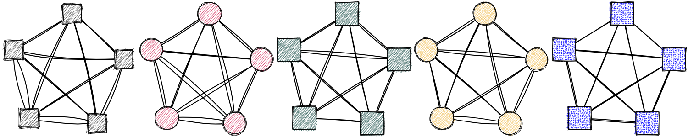
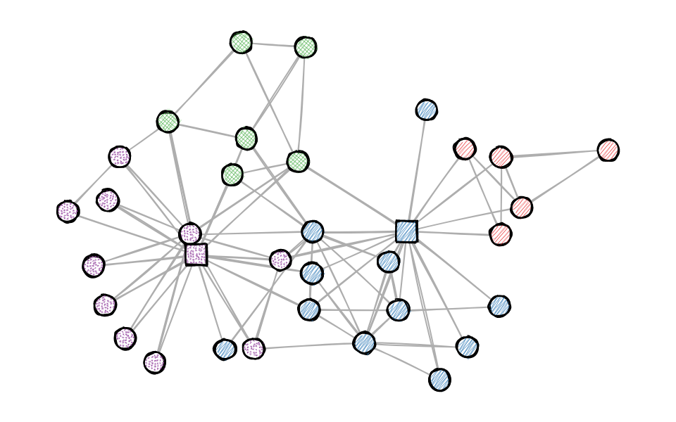

<!-- README.md is generated from README.Rmd. Please edit that file -->

# roughnet 

<!-- badges: start -->

[](https://CRAN.R-project.org/package=roughnet)
[](https://github.com/schochastics/roughnet/actions/workflows/R-CMD-check.yaml)
<!-- badges: end -->

Using the java script library [rough.js](https://roughjs.com/) to draw
sketchy, hand-drawn-like networks.  
(*Checkout [ggrough](https://xvrdm.github.io/ggrough/) for turning
general ggplot objects into sketchy drawings*)



## Installation

You can install the developers version of roughnet with:

``` r
# install.packages("remotes")
remotes::install_github("schochastics/roughnet")
```

## Example

The package currently only works with {{igraph}} objects by setting
styling elements as vertex/edge attributes.

``` r
library(roughnet)
library(igraph)

g <- make_graph("Zachary")
V(g)$shape <- "circle"
V(g)$shape[c(1,34)] <- "rectangle"
V(g)$fill <- c("#E41A1C", "#377EB8", "#4DAF4A", "#984EA3")[membership(cluster_louvain(g))]
V(g)$fillstyle <- c("hachure", "zigzag", "cross-hatch", "dots")[membership(cluster_louvain(g))]
V(g)$color <- "black"
V(g)$size <- 30
V(g)$stroke <- 2
E(g)$color <- "#AEAEAE"
roughnet(g,width = 960,height = 600)
```



You can save the plot with the function `save_roughnet()` (needs
{{pagedown}} to be installed.)

``` r
# install.packages("pagedown")
p <- roughnet(g,width = 960,height = 600)
save_roughnet(p,"karate.png")
```

## Extended Example

The package also allows to place labels in or around vertices and
implements some custom vertex shapes.

``` r
# install.packages(c("signnet","graphlayouts"))
library(signnet)
library(graphlayouts)
library(dplyr)

data("avatar") # Allies/Enemies relations in Avatar: The Last Airbender

main <- induced_subgraph(avatar,which(V(avatar)$main)) #only use the main characters

#calculate layout
w <- ifelse(E(main)$sign==1,3,1)
xy <- layout_with_stress(main,weights = 1/w)

V(main)$x <- xy[,1]
V(main)$y <- xy[,2]

V(main)$fill <- case_when(V(main)$affiliation=="earth kingdom"~"#8B6914",
                          V(main)$affiliation=="fire nation"~"#CD2626",
                          V(main)$affiliation=="water tribe"~"white",
                          V(main)$affiliation=="air nomad"~"#98F5FF",
                       TRUE~"grey"
)

V(main)$color <- case_when(V(main)$affiliation=="earth kingdom"~"#8B6914",
                          V(main)$affiliation=="fire nation"~"#CD2626",
                          V(main)$affiliation=="water tribe"~"#1874CD",
                          V(main)$affiliation=="air nomad"~"#98F5FF",
                          TRUE~"grey"
)

V(main)$shape <- case_when(V(main)$affiliation=="earth kingdom"~"earth",
                           V(main)$affiliation=="fire nation"~"fire",
                           V(main)$affiliation=="water tribe"~"water",
                           V(main)$affiliation=="air nomad"~"air",
                           TRUE~"circle"
)


E(main)$width <- ifelse(E(main)$sign==1,1.2,0.3)
E(main)$color <- ifelse(E(main)$sign==1,"#228B22","#CD3278")
V(main)$label <- V(main)$name
# position labels in the (c)enter of the vertex or (n)orth, (e)ast, (s)outh, or (w)est of it 
V(main)$pos <- c("n","s","s","s","s","e","n","e","s","n") 

roughnet(main, width = 600, height=600, font = "30px Herculanum")
```


